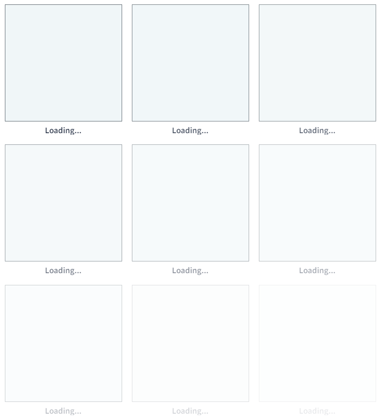
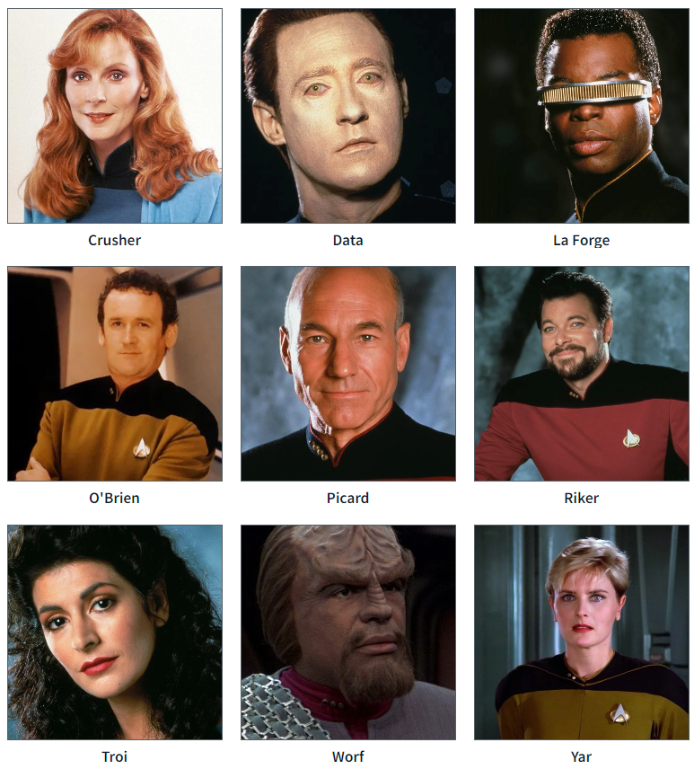

# Gallery

## Description

This component renders images (cropped into squares) in a responsive grid with optional captions.

## Visual

Loading:  
  
Loaded:  


## API

```html
<Gallery disabled="false" isLoading="false" items="[]" loadingItemCount="4" size="192" />
```

(above values are defaults if not passed in)

- `disabled` [boolean]: if true, prevents on-click actions (see `action` below)
- `isLoading` [boolean]: if true, displays placeholder items (see above "Loading" image)
- `items` [array]: items to show in the gallery (see below for item details)
- `loadingItemCount` [integer]: number of placeholder images to show if `isLoading` is true
- `size` [integer]: base width and height of each item in pixels (thumbnails may scale up slightly from this size to fill the available width of the grid)

Each object in the `items` array should have the following properites:

- `action` [function]: an optional function to run if the item is clicked (and the gallery is not `disabled`)
- `caption` [string]: an optional caption to display under the image
- `id` [string]: a unique identifier for the item
- `imageURL` [string]: the URL of the image to display (optional - empty image placeholder will be shown if string is empty)
- `tooltip` [string]: an optional tooltip to display when hovering over image
